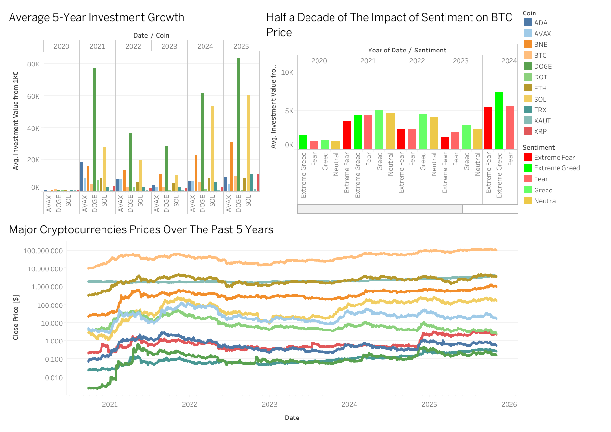

# crypto-sentiment-roi-analysis

## Process and Design Decisions

The aim of this visualization is to explore how community sentiment affecting concurrency investment trends and price movements over the years. The datasets were collected and gathered using python library and API to get the data of prices and community sentiment (Greed&Fear Index) since 2020 until now. The datasets were then cleaned, merged, and exported as csv Excel file as the data source for Tableau. The dashboard combines lines and bar charts: a logarithmic line chart ndefinedfor major cryptocurrency prices over several years and grouped bar charts for average investment values segmented by sentiment. A logarithmic scale was applied was applied to the price axis to normalize the large variation between high-value coin and smaller altcoins (alternative coins). The bar charts were selected to visualize categorical comparisons. Color encodings were used to determine the sentiment with green hues for positive sentiment (Greed and Extreme Greed) and red hues for negative sentiment (Fear and Extreme Fear) while yellow for Neutral. Plus, it also was used to classify each coin with different colors.

The story of this dashboard aims to tell which coin is the best coin based on the ROI (return of invest) from 1000 euro from the starting point until now. The visualization effectively highlights sentiment trends and corresponding investment behaviors, revealing how emotional dynamics can influence our ROI. However, aggregating data annually may obscure short-term volatility or intrayear sentiment shifts. Similarly, while color encoding clarifies sentiment patterns, it may oversimplify nuanced emotional variations not captured in categorical data. Despite these limitations, the design succeeds in communicating long-term sentiment-driven investment trends clearly and effectively.

## Visualization

[View From Tableau](public.tableau.com/app/profile/tran.doan.chau/viz/Book1_17624463337610/Dashboard1)

